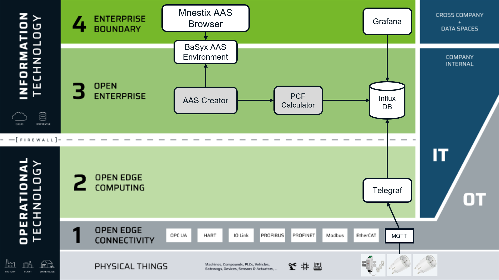
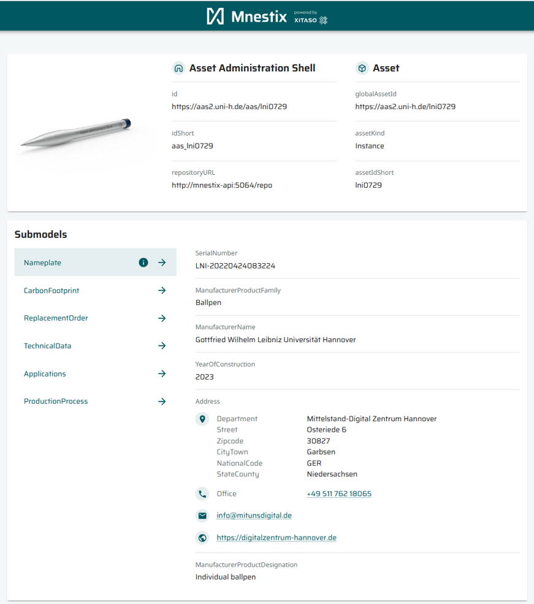
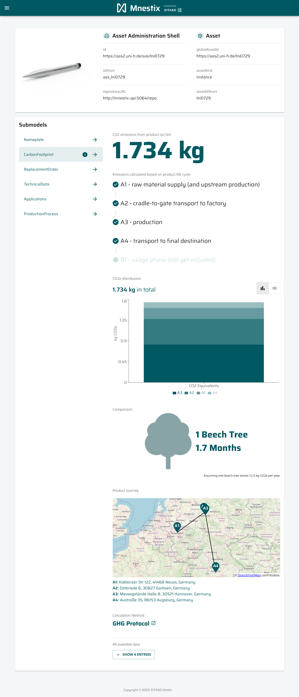

# AAS PCF-Challenge
**Create your DPP 4.0 with Submodels Digital Nameplate and Carbon Footprint**

### Architecture Guardrail


### Your local AAS test environment: Mnestix Browser with BaSyx AAS Environment
Download this repository and run in your command line ```docker compose -f 'Mnestix\docker-compose.yaml' up```\
Mnestix-API  publishes the Demo AAS on startup to the BaSyx AAS Environment.
You will get:
- Demo AAS (json): http://localhost:8081/shells/aHR0cHM6Ly9hYXMyLnVuaS1oLmRlL2Fhcy9sbmkwNzI5
- Demo Carbon Footprint Submodel (json): http://localhost:8081/submodels/aHR0cHM6Ly9hYXMyLnVuaS1oLmRlL3NtL2xuaTA3MjlfUENG
- Demo Digital Nameplate Submodel (json): http://localhost:8081/submodels/aHR0cHM6Ly9hYXMudW5pLWguZGUvc20vYUhSMGNITTZMeTloWVhNeUxuVnVhUzFvTG1SbEwyRmhjeTlzYm1rd056STVfRE5Q
- Demo AAS in the Mnestix Browser: http://localhost:3000/en/viewer/aHR0cHM6Ly9hYXMyLnVuaS1oLmRlL2Fhcy9sbmkwNzI5
- Mnestix API Swagger-UI: http://localhost:5064/swagger/index.html
- BaSyx Environment API Swagger-UI: http://localhost:8081/swagger-ui/index.html

### Needed Submodel Templates
- Digital Nameplate: https://github.com/admin-shell-io/submodel-templates/tree/main/published/Digital%20nameplate/3/0
- Carbon Footprint: https://github.com/admin-shell-io/submodel-templates/tree/main/published/Carbon%20Footprint/0/9

### AAS Creator
There are many possibilities to create AAS:
- Creating a single AAS: Eclipse Package Explorer: 
    - https://github.com/eclipse-aaspe/package-explorer
    - Video series on YouTube: https://www.youtube.com/playlist?list=PLCO0zeX96Ia3y-6DzA6DO_VcHnX758rc5    
- Creating AAS simple by filling json-templates
    - Take the provided demo Submodels as a template a replace placeholders 
    - node-RED might be a good tool for starting: https://nodered.org/
- Creating AAS with DataIngest-Endpoint of Mnestix-API
    - http://localhost:5064/swagger/index.html#/AasCreator
    - http://localhost:5064/swagger/index.html#/DataIngest/DataIngest_AddDataToAas
    - Documentation: https://hub.docker.com/r/mnestix/mnestix-api
- Creating AAS programmatically with SDK:
    - BaSyx Python SDK: https://github.com/eclipse-basyx/basyx-python-sdk 
- Validating created AAS:
    - https://twinfix.twinsphere.io/ 
    - https://github.com/admin-shell-io/aas-test-engines

#### Hint: Convert AASX to Json-AAS/SM and vice versa
Right now there are 3 types of AAS specified: \
 \
Type 1 = AASX file \
Type 2 = API which returns (in most implementations) json \
Type 3 = not relevant in this challenge

**Convert**...
- ...from **AASX to AAS**: Use the (not standardized) upload-endpoint of the BaSyx Environment to import AASX file. Then use the /shells and /submodels endpoint to get the AAS and Submodels as json \
https://wiki.basyx.org/en/latest/content/user_documentation/basyx_components/v2/aas_environment/features/upload.html
- ...from **AAS to AASX**: Use the serialization-endpoint to get an AAS including Submodels as AASX file \
https://app.swaggerhub.com/apis/Plattform_i40/AssetAdministrationShellRepositoryServiceSpecification/V3.0.2_SSP-001#/Serialization%20API/GenerateSerializationByIds

### PCF Calculator
Workflow (simplyfied)
1. Collect Energy Consumption Data
2. Determine Emission Factor (e.g. https://app.electricitymaps.com)
3. Calculate Carbon Footprint (Greenhouse Gas Protocol: https://ghgprotocol.org/)
4. Normalize per Product Unit


### Grafana and Telegraf
See: https://grafana.com/grafana/dashboards/928-telegraf-system-dashboard/?pg=dashboards&plcmt=featured-dashboard-4

### Home of Mnestix
https://github.com/eclipse-mnestix

### Screenshots of demo AAS in Mnestix Browser
- Submodel Digital Nameplate

- Submodel Carbon Footprint
>